# Installing Xilinx

- Make sure you have at ~60GB free on your computer.
- Create an account on [xilinx.com](https://login.xilinx.com/app/xilinxinc_f5awsprod_1/exknv8ms950lm0Ldh0x7/sso/saml)
- You have two choices on the install, you can either run the web installer which downloads the files from Xilinx (takes between 1-2 hours), or USB sticks with the local installer will be passed around in class.

## Web Installer

```bash
cd /path/to/installer # Replace this with wherever you downloaded the installer to.
chmod +x Xilinx_Unified_2021.1_0610_2318_Lin64.bin # This takes the downloaded file and makes it executable. Only do this with files you trust!
./Xilinx_Unified_2021.1_0610_2318_Lin64.bin # Runs the installer. Prefix with sudo if you want to install into /opt or other protected area.
```

## Local Installer
And for the local installer:
```bash
cd /path/to/local/installer
cd Vivado_2021.1
./xsetup # Prefix with sudo if you want to install it into /opt or other protected area. 
```

## Install Settings

*The local install looks different since most of the options are already hard coded.*

Hit Next.

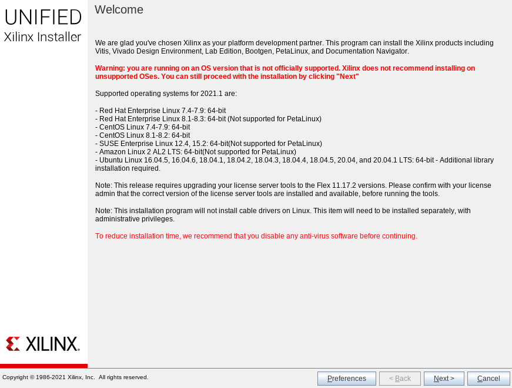

Enter your username and password for xilinx.com. Hit Next.

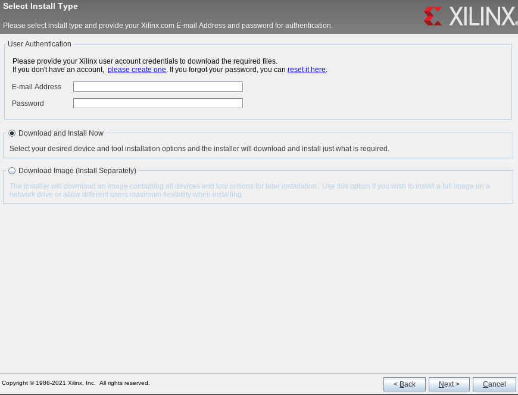

Select `Vivado`. Hit Next.

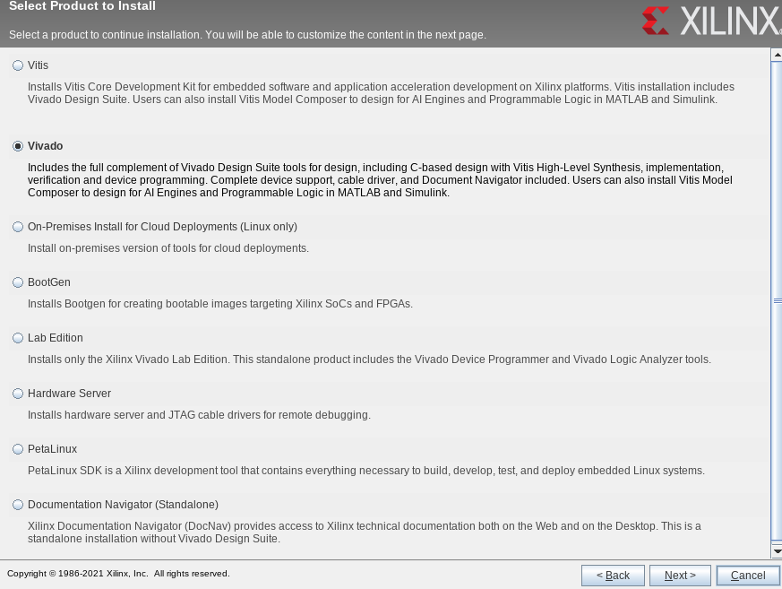

Select `Vivado ML Standard`. Hit Next.

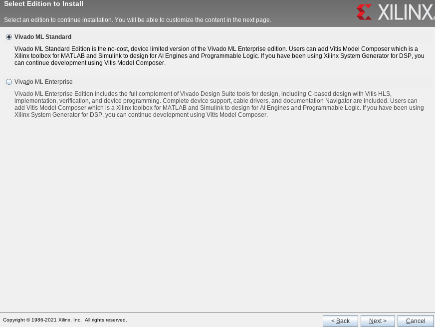

Make sure the settings match, then hit Next. TODO(alternate image for lower disk usage, deselet SoC, vitis model composer, and docnav)


Agree to the licenses. Hit Next.

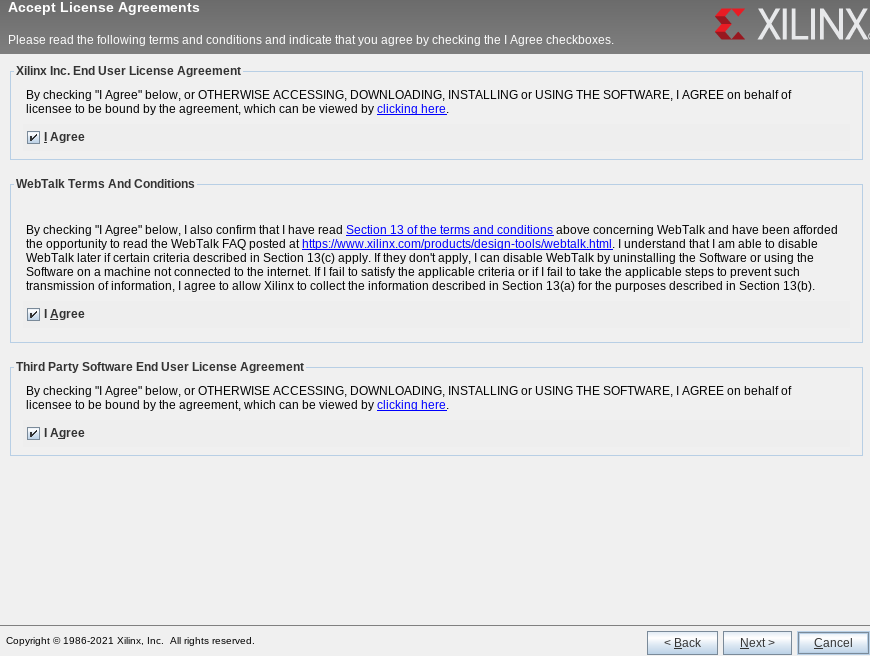

Pick where you want this installed. Remember this directory for later!

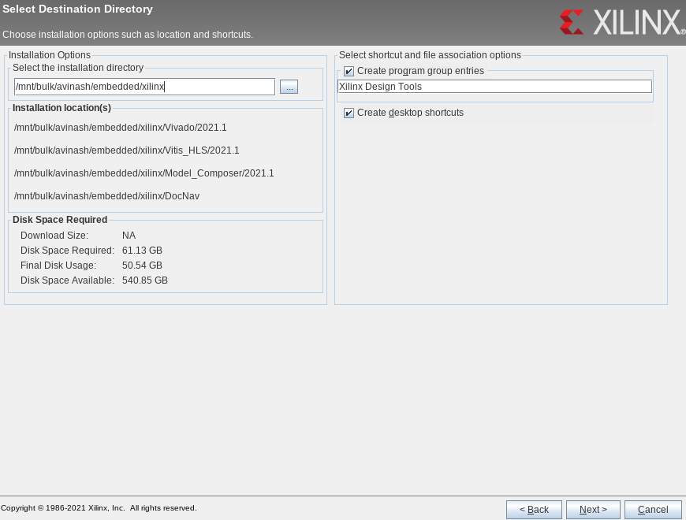

Hit Next, then wait ~30 min (local install) to 1-2 hours (web install). 

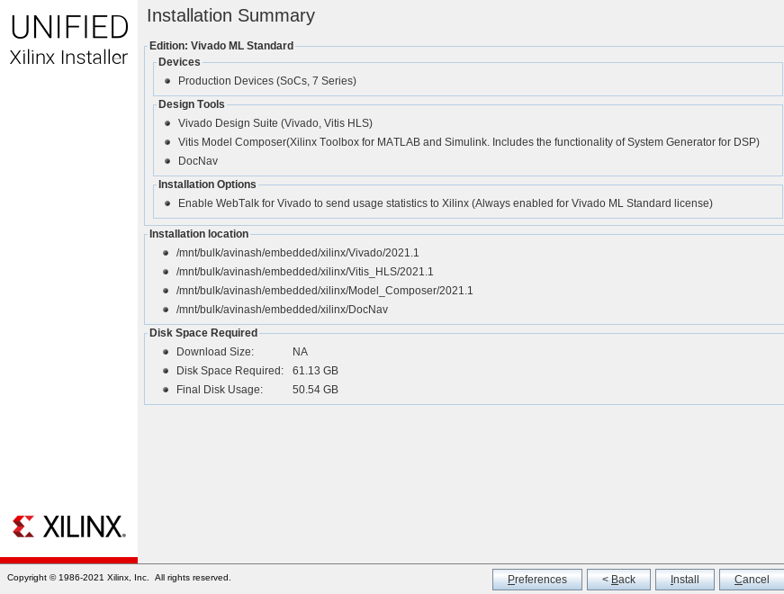

Once done, you might get this warning:

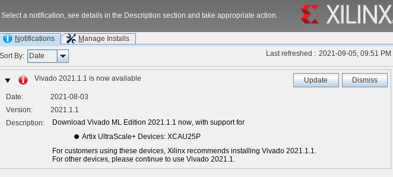

You can dismiss it, we don't require the update for these labs.

## Bash Settings

Edit your `~/.bashrc` file and add the following function to the end, make sure to change `XILINX_INSTALL_PATH` to what you picked earlier.

```bash
# Make a variable with the install path.
export XILINX_INSTALL_PATH="/path/to/xilinx/install/"
export XILINX_VERSION="2021.1"
export VIVADO_PATH=${XILINX_INSTALL_PATH}/Vivado/${XILINX_VERSION}
function setup_xilinx(){
    # Calls the Xilinx setup scripts so that you can run the tools.
    source ${VIVADO_PATH}/settings64.sh
}
```

If you have any open terminals you can run `source ~/.bashrc` to have this change take effect (any new terminals you open will be all set). 

Having this setup as a function is useful because Xilinx's tools have a notorious habit of interfering with important shell parameters, especially when you are running competing/other embedded tools. Now you just need to run `setup_xilinx` from your command prompt before running any Xilinx commands, and you should be all set!

## Cable Drivers

```bash
setup_xilinx # Remember to `source ~/.bashrc` or open a new terminal before running this.
cd ${VIVADO_PATH}/data/xicom/cable_drivers/lin64/install_script/install_drivers
sudo ./install_drivers
```
Make sure you see the message `INFO: Driver installation successful.` after running the above.

# Install Check

```bash
setup_xilinx
vivado & # The `&` tells the terminal to not block after the command. Useful for running gui programs from the command line.
```

The Vivado launch panel should show up if you configured everything correctly!

# Setting an external text editor
- Launch vivado
- Tools -> Settings -> Text Editor
- Either pick something from the drop down, or pick custom editor and enter the command to edit. For example, I use vscode, so my Editor is set to `code -g [file name]:[line number]`.

# Instructor Documentation

## Pending Features
- [ ] TODO@(avinash): UG973 has instructions for installing linux cable drivers. See if these are required or if we can get away with just the Digilent Adept tools.
- [ ] Mark this section as optional if `symbiflow` is good enough.

## Creating "local install" images
- Run the web installer as above, then:

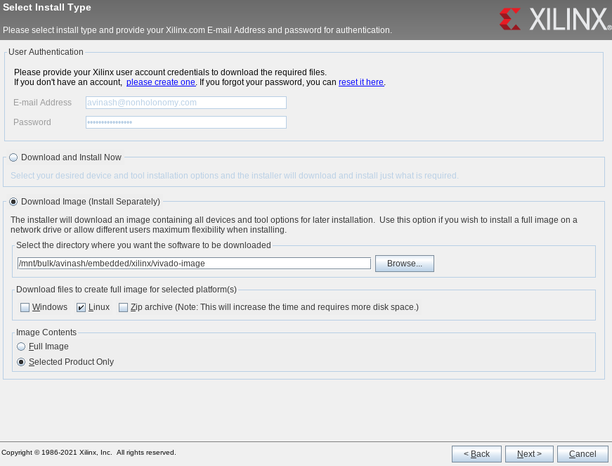
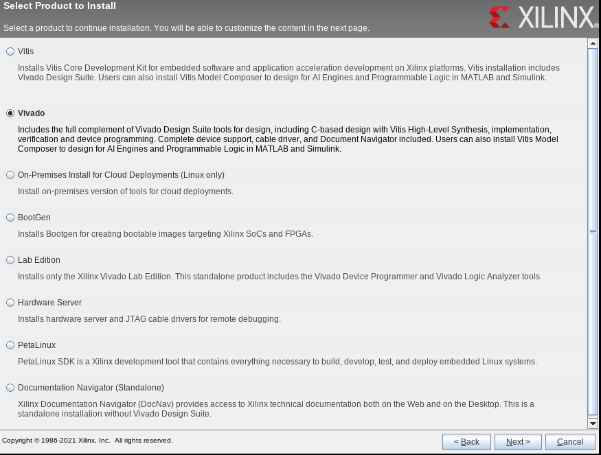
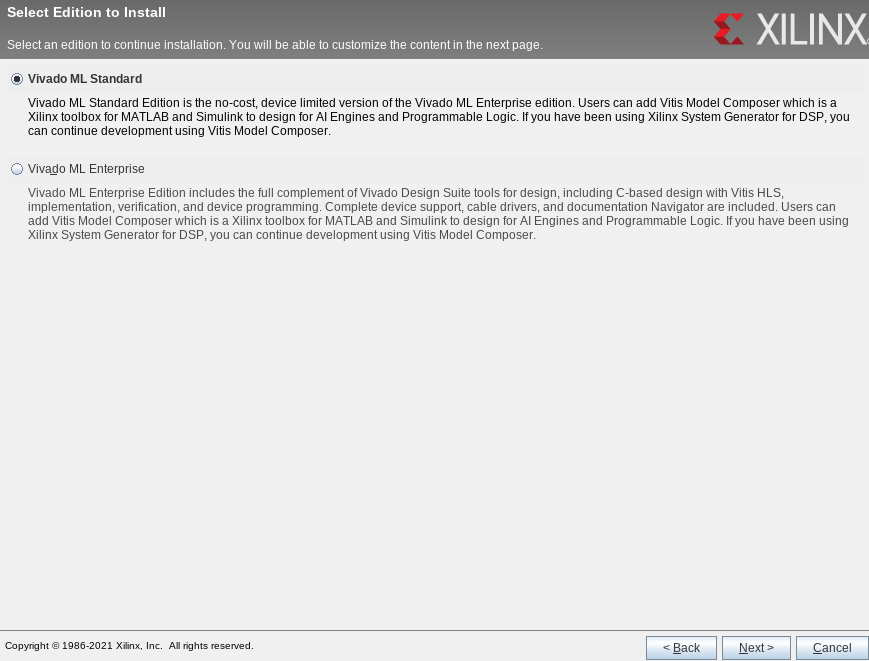
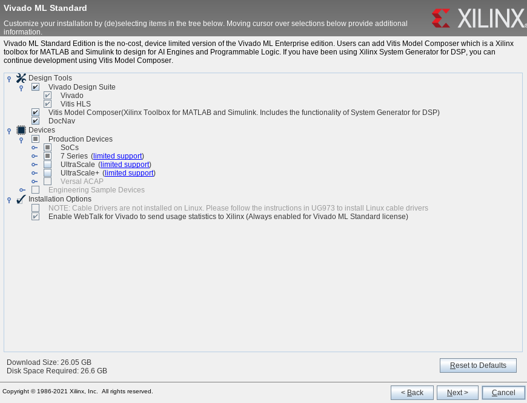